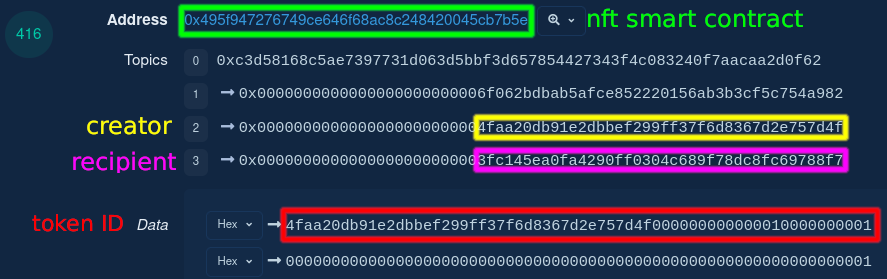

# Copyright Vulnerabilities in NFTs #

Many NFT and DAOs are designed to provide new or more convenient ways to
own and sell creative works. Beeple's [EVERYDAYS: The First 5000 Days](https://onlineonly.christies.com/s/beeple-first-5000-days/beeple-b-1981-1/112924) sold at auction for [$69 million](https://www.christies.com/features/monumental-collage-by-beeple-is-first-purely-digital-artwork-nft-to-come-to-auction-11510-7.aspx). Some observers think that the [Bored Ape Yacht Club](https://boredapeyachtclub.com)'s spectacular rise [is due to](https://www.yahoo.com/video/bored-apes-generous-copyright-approach-151139108.html) its permissive copyright approach. Some artists and developers are diving in head-first.

But at the same time, many of these projects have run into copyright trouble due to confusion about how copyright applies to NFTs:

* When the [SpiceDAO](https://twitter.com/TheSpiceDAO) bought a copy of the
  lavishly illustrated [pitch
  book](https://www.theverge.com/2014/3/27/5554126/jodorowskys-dune-interview-greatest-sci-fi-film-never-made)
  that director Alejandro Jodorowsky made for a never-filmed version of _Dune_,
  [some participants
  hoped](https://www.theverge.com/2022/2/28/22950868/spice-dao-crypto-jodorowsky-dune-bible-collective-writing-contest)
  that buying the book would allow them to bring Jodorowsky's vision to the
  screen. But this plan was quickly scrapped when owners of the _Dune_
  copyrights vetoed the idea.
* "[Right-clickers](https://www.vice.com/en/article/5dgzed/what-the-hell-is-right-clicker-mentality)"
  save JPEG copies of the artwork from popular NFTs. The owners of those NFTs
  say this is copyright infringement. Only one of the two can be right.
* Quentin Tarantino and Miramax are [locked in
  litigation](https://www.theverge.com/2021/11/17/22787216/miramax-pulp-fiction-quentin-tarantino-nft-lawsuit)
  over the rights to _Pulp Fiction_ NFTs. Too many NFTs to count use [stolen
  art](https://fortune.com/2021/08/04/nfts-copyright-violations-penalties-non-fungible-tokens-collectibles-nfttorney-jonathan-schmalfeld/).

We hope in this blog post to clear up some of the confusion around NFT
copyrights, and to help people working in the space understand the challenges of
fitting NFTs to the framework of copyright law. Our bottom line is simple:
ownership of an NFT **can** be used to give the owner substantial control over a
creative work, but that control is not automatic. Copyright law does **not**
give an NFT owner any rights unless the creator takes affirmative steps to make
sure that it does. Our survey of some existing NFT projects and their licenses
reveals that **very few** of them take all of the necessary steps needed to make
NFT copyrights behave the way that community members expect. Thinking through
the legal issues should be part of the NFT design process, not an afterthought.


## On-Chain and Off-Chain Assets ##

When talking about blockchain assets, it is common to say things like "Alice
owns 10 Bitcoin." Most of the time, it is clear what this means: Alice controls
the private key to a blockchain address that has been transferred 10 Bitcoin in
unspent transaction outputs. Alice, if she wishes, can use that private key to
transfer those Bitcoin to another address. (Alice might control the key directly
or via a wallet; we will ignore this complication in what follows.) In the words
of the  [current draft Uniform Commercial
Code](https://www.uniformlaws.org/HigherLogic/System/DownloadDocumentFile.ashx?DocumentFileKey=c7232d9c-6f39-0576-935e-8ad76333240f&forceDialog=0)
article for blockchain assets, Alice has "the power to avail \[herself\] of
substantially all the benefit from" those Bitcoin. For more complicated assets, 
like an NFT controlled by a smart contract, this control might take the 
form of knowing the private key needed to initiate a transaction transferring
control to someone else.

This case is easy because Bitcoin and smart contract tokens are _on-chain
assets_. They exist entirely as entries on a blockchain. Matters are more
complicated for _off-chain assets_, in which an entry on a blockchain is used to
represent something that exists somewhere else, like a [tungsten
cube](https://opensea.io/assets/0x495f947276749ce646f68ac8c248420045cb7b5e/36033305814565393839012117540795495898903988734891995320738861183142759235585/).
The _cube itself_ is a physical object that exists in the physical world. It
weights 2,000 pounds, measures 14.545 inches on a site, and sits in the
Willowbrook, Illinois warehouse of Midwest Tungsten Service (MTS). But the
_Tungsten Cube NFT_ is an entry in a smart contract deployed on the Ethereum
blockchain using the [ERC-1155](https://eips.ethereum.org/EIPS/eip-1155)
standard. If Alice buys the tungsten cube NFT from TungstenDAO, the physical
cube will still be sitting in Willowbrook, Illinois.

Although the Tungsten Cube NFT is not the _same_ as the physical tungsten cube,
the two are _connected_. According to the "Description" provided by TungstenDAO
to OpenSea when it created the NFT listing, when Alice acquires the NFT, she is
also entitled to "One visit to see/photograph/touch the cube per calendar year."
If Alice sends the NFT to a special address that prevents anyone from ever 
controlling the NFT again (a process called burning), she is entitled to receive
physical possession of the cube "via freight truck." If she sells the NFT to 
Bob, then Bob will be entitled to visit the cube once a year, or to burn the NFT
and receive the cube. Some lawyers call this connection "tethering": rights in 
an off-chain asset (the physical cube) are linked by an invisible tether to an 
on-chain asset (the NFT). (In theory, at least. [Some legal
scholars](https://papers.ssrn.com/sol3/papers.cfm?abstract_id=3928901) are
 skeptical about whether tethering actually works.)

Thus, there are actually three diffrent kinds of assets involved in an NFT.
Yes, three.

First, there is an **NFT** itself on the blockchain. It looks like this:



You can view the creation of this NFT online on the Etherscan blockchain 
explorer
[here](https://etherscan.io/tx/0x3feb5cbee8aae8abde269e46ca3061da5c4c1bbe1b0fa42f665c2e15f55c7c7d)
.

Second, there is the **physical cube** in a warehouse. It looks like this:


Third, there is the **legal right** to control the physical cube. It looks like
this, because legal rights are intangible and have no physical existence:


If everything works correctly, the legal right is what links the on-chain
NFT to the off-chain cube. The current owner of the NFT is able to
control the physical cube because they _also own_ the associated legal right.

## A Copyright Primer ##

The following quote is sometimes (humorously but incorrectly) [attributed to](https://quoteinvestigator.com/2012/02/24/telegraph-cat/) Albert Einstein:

>You see, wire telegraph is a kind of a very, very long cat.  You pull his tail
>in New York and his head is meowing in Los Angeles.  Do you understand this?
>And radio operates exactly the same way: you send signals here, they receive
>them there.  The only difference is that there is no cat.

A copyright is exactly like a tungsten cube except that there is no cube. A
tungsten cube is a specific physical object. It exists in one place. Any other
tungsten cube is a different cube. But a creative **work** like a photograph or
a story is intangible. It can exist in exactly one object (called a **copy**) like
an oil painting on a canvas. Or a work can exist in many copies at once
like when a publisher prints thousands of copies of a book, or when a
photograph is displayed on millions of computer screens. Or a work can exist in no
copies at all, like when one person tells another person a story. The point is
that a creative work is not the same as any of the copies that embody it.

Thus, the **copyright** in a creative work behaves differently than ownership
of a physical object, like a tungsten cube. The owner of the cube can move it,
sculpt it, or melt it down; if someone else does any of these, they violate the
owner's property rights. But the owner of a copyright isn't necessarily the owner
of any specific copies. If Alice buys a copy of Bob's novel, Alice owns the
physical copy -- the paper with ink marks on it -- but Bob owns the copyright 
in the words.

Instead, Bob's copyright consists of a limited set of [exclusive
rights](https://www.law.cornell.edu/uscode/text/17/106). Most importantly, Bob
can prevent anyone, including Alice, from _making more copies_ of his novel.
(That's why it's called a "copy" "right.") If Alice wants to make a movie
adaptation of Bob's novel -- in copyright terminology, a
[derivative](https://www.law.cornell.edu/uscode/text/17/101)
[work](https://www.law.cornell.edu/uscode/text/17/103) -- she needs Bob's
permission. She can get it in one of two ways. Either she can buy the copyright
outright from Bob -- a **transfer** of ownership -- or Bob can retain the
copyright and give Alice a **license** to make the movie. The difference is that
if Alice becomes the new owner via transfer, she can now decide whether to
authorize other uses, like graphic novels and action figures. If Bob merely
gives Alice a license, he retains the authority to decide how else to use (or
not) the copyright.

## NFTs, Copies, and Copyrights ##

Back to NFTs. It should be apparent now that an NFT can be tethered to a
creative work in one of two ways. First, it could be used to control a _copy_
of the work: just like whoever owns the Tungsten Cube NFT is entitled to possession
of the tungsten cube, whoever owns the Physical Copy NFT is entitled to posess
a specific copy of the work. Second, it could be used to control the _copyright_
in the work: whoever owns the Intangible Copyright NFT is now entitled to decide
who gets to make new copies. The two could go together, _but they don't have to_.

This is where the more ambitious hopes for the SpiceDAO went wrong. The project
bought and tokenized ownership of one physical copy of Jodorowsky's pitch book.
The owners of SPICE tokens can (collectively) decide to [sell or
lend](https://www.law.cornell.edu/uscode/text/17/109) it to others, or put it on
public display offline. But they never had, and couldn't tokenize, ownership of
the copyright in the underlying creative works. The copyright in _Dune_ the novel is still held by [Frank Herbert's estate](https://variety.com/2016/film/news/legendary-dune-frank-herbert-1201923648/), which licensed
film rights to Legendary Entertainment, which produced the 2021 film version; the copyrights in the 
artwork in the pitch book is held by [the original artists](https://www.buzzfeednews.com/article/amansethi/spicedao-dunedao-soby) and their estates.

Another failure mode for NFT copies is that copyright law has an unintuitive
concept of _what counts as a copy_. We have been talking about obviously
distinct physical things, like printed books. But "copies" under [U.S. copyright
law](https://www.law.cornell.edu/uscode/text/17/101) include any "material
objects ... in which a work is fixed by any method now known or later developed,
and from which the work can be perceived, reproduced, or otherwise communicated,
either directly or with the aid of a machine or device." This definition
includes hard drives and SSDs, and [sometimes even
RAM](https://scholar.google.com/scholar_case?case=5882317517996842407). Every
computer that interacts with the work makes a separate "copy" for copyright
purposes; even just browsing to a webpage makes a "copy" of the images on it on
your computer. Thus, for all practical purposes any NFT that includes digital
artwork _must_ include some copyright interest (either a transfer or a license)
or the owner of the NFT will become an infringer the moment they attempt to do
anything with the artwork. 

In particular, it is _not_ sufficient to give an NFT purchaser a copy of the
artwork. U.S. copyright law [explicitly
states](https://www.law.cornell.edu/uscode/text/17/202) that transfers of
copyrights and transfers of copies are different:

>Transfer of ownership of any material object, including the copy or phonorecord
>in which the work is first fixed, does not of itself convey any rights in the
>copyrighted work embodied in the object; nor, in the absence of an agreement,
>does transfer of ownership of a copyright or of any exclusive rights under a
>copyright convey property rights in any material object.

If you buy an oil painting from an artist, you don't also receive ownership
of the copyright. Yes, you own the original, but the artist retains the
copyright, and they can sell prints of it if they like. If you want to buy the
copyright too, you'll need to get a separate agreement. The same is true for
NFTs. Unless an NFT explicitly gives owners _copyright_ interests as opposed to
just access to the artwork, owners should not assume that they have any rights
to use the artwork or to stop others from using it.

Some popular NFT projects, including the
[CryptoPunks](https://www.larvalabs.com/cryptopunks), have been released with no
explicit copyright terms. (the creator, Larva Labs, later went back and tried to retroactively add
a copyright license; some legal scholars are
[skeptical](https://papers.ssrn.com/sol3/papers.cfm?abstract_id=3978963) whether
this works.) This is legally risky for all concerned. An adversary could
approach the NFT creator, buy out the copyright to the artwork, and then sue NFT
purchasers for infringement if they put the images in their profile pictures, on
OpenSea listings, etc. This is not the intent of the creators and purchasers, and
we hope that courts would not cooperate in a copyright-based attack like this,
but without clarity around the copyright rights of NFT owners, there is a risk
that it could happen. (The courts are not known for their nuanced understanding
of cutting-edge blockchain technologies and community norms.)

(Tyler note: do we want to make mention of Yuga's relicensing of cryptopunks  
in the above paragraph?)

Even more blatantly, some NFTs create copyright trouble by using artworks [stolen from
artists](https://hyperallergic.com/702309/artists-say-plagiarized-nfts-are-plaguing-their-community/),
or famous works that the NFT creators have [no connection
with](https://slate.com/technology/2022/02/hitpiece-nfts-crypto-music-controversy.html)
and no license from. Copying these works as part of the NFT marketing (e.g. for
OpenSea listings)  can be copyright
infringement. In addition, an NFT creator could be engaged in false advertising by 
implying that NFT owners will receive rights in these stolen works. Indeed,
because copyright infringement is "strict liability," NFT owners who make
copies of stolen art could also be liable for infringement, even if they
were misled by the NFT creator into thinking that it was properly licensed.

While straight-up scam artists are unlikely to care about infringement, it is
unfortunate that many well-meaning projects also seem to believe that minting an
NFT of a work somehow automatically brings with it some copyright interest in
the work. One particularly tragic example is Andy Williams, who [created an
NFT](https://www.washingtonpost.com/technology/2022/02/22/expunge-his-daughters-murder-internet-father-created-an-nft-grisly-video/)
of TV video footage depicting his daughter's murder. Parker was apparently
advised that creating an NFT would give him enough of a copyright in the footage
to have it removed from sites like Facebook and YouTube. But copyright doesn't
work that way. The television station that filmed the footage owns the
copyright. Parker can't change that by minting an NFT of it.

Another related myth of NFTs is that minting one helps enforce copyright against
infringers. The Associated Press's Director of Blockchain, for example, has
[argued](https://twitter.com/fr_brennan/status/1497262530112237569) that
creating NFTs of some of its photographs would make it easier to make
unauthorized users take them down. But copyrights come from copyright law, not
from the blockchain. The process to file a copyright lawsuit or a [DMCA takedown
notice](https://en.wikipedia.org/wiki/Notice_and_take_down#United_States) isn't
made any easier by having an NFT of the work.  To be sure, in a Web3 future
where absolutely everything is on the blockchain and nothing is possible unless
it is approved by a blockchain transaction, it would be technically impossible
to post a photograph without an explicit license from the copyright owner. But
first, that world is not the world of today, and second, a world where speech is
impossible without advance permission would be profoundly dystopian. It would run
completely against the values of freedom and openness that blockchain is
supposed to stand for.


## Copyright Transfers Are Hard ##

Actually ensuring that NFT owners have the copyrights they think they do is also 
a subtler problem than it appears. Consider the following passages from the
Bored Ape Yacht Club [Terms & Conditions](https://boredapeyachtclub.com/#/terms):

>i. You Own the NFT. Each Bored Ape is an NFT on the Ethereum blockchain. When
>you purchase an NFT, you own the underlying Bored Ape, the Art, completely.

This looks like it tethers ownership of the copyright to ownership of the NFT.
Suppose that Woodchuck Labs uses these terms for its WoodChuckers NFTs. When
Alice buys a WoodChucker NFT, she acquires the copyright. When she sells the NFT
to Bob, he acquires the copyright. In copyright terms, there is a transfer of
copyright ownership to Alice when she buys the NFT, and then another one from
Alice to Bob when she sells him the NFT. Full ownership of the copyright lets
Alice use the artwork -- e.g. to display in her Twitter profile inside a
hexagon. It also lets her sue for infringement, if she wishes, any
right-clickers who download and display the artwork.


Unfortunately, _copyright doesn't work this way_. The problem is that U.S.
copyright law sets a high threshold for what it takes to transfer ownership of a
copyright. [Section 204(a)](https://www.law.cornell.edu/uscode/text/17/204) of
the Copyright Act states:

>A transfer of copyright ownership, other than by operation of law, is **not
>valid unless** an instrument of conveyance, or a note or memorandum of the
>transfer, is **in writing and signed by the owner** of the rights conveyed or
>such owner’s duly authorized agent. (emphasis added)

The writing part isn't a problem; the terms on the website count as a "writing"
under [federal
law](https://scholar.google.com/scholar_case?case=7612208998812419954). The
bigger issue is that the BAYC terms aren't "signed" by the copyright owner, Woodchuck
Labs. Without a signature, it is not possible to pass ownership of the copyright to Alice.

In theory, Woodchuck Labs could fix the lack of a signature at this first step by
modifying the terms to add a signature line. Under the [E-SIGN
Act](https://www.law.cornell.edu/uscode/text/15/7001), even a digital signature
like a person's name printed in a script typeface [can be
a](https://www.law.cornell.edu/uscode/text/15/7006) "process, attached to or
logically associated with a contract or other record and executed or adopted by
a person with the intent to sign the record" (emphasis added). Indeed,
[courts have
held](https://scholar.google.com/scholar_case?case=7612208998812419954) that
clicking "I agree" to a website's terms when you create an account is enough to
show the "intent to sign." (There are some timing issues, like the ones with the
CryptoPunks relicensing, but that's an issue for another time.)

Unfortunately, there is a bigger problem. It arises when Alice decides to resell
the WoodChucker to Bob. The intent of the BAYC terms is that Bob now owns the
copyright and Alice doesn't. But thanks to the signature requirement, that's not
what happens. _There is no signed transfer of copyright from Alice to Bob_.
Without a signed transfer, Alice still owns the copyright, not Bob.

This is where the difference between smart contracts and legal contracts rears
its head. Bob might try to argue that Alice has agreed to the BAYC terms, which
make him the copyright owner. But Alice hasn't! As far as she's concerned, the
BAYC terms are just a bunch of words on a website somewhere.  The copyright
system wasn't created with digital tokens in mind and doesn't know about them.
As far as it's concerned, Alice owns the Woodchucker copyright and hasn't done
anything to give up ownership. Legal contracts typically only bind the people
who explicitly agree to them. 

True, Alice has has invoked an ERC-721 smart contract ```transferFrom()```
method to transfer the Bored Ape to Bob and applied her cryptographic signature
to the smart contract transfering the NFT to Bob. But that method is a 
_smart-contract_ term, not a _legal-contract_ term. The smart contract 
(XXX TK/YJ link to source code XXX tyler: there is no source code this is an abstract example. Unless you want to reference the smart contract in the tungsten cube example...) doesn't say anything about copyright or link to the BAYC terms. Even
if it did, there would be no guarantee that Alice had read or even knew about
those terms. She would not have attached her cryptographic signature to a
transaction "attached to or logically associated with a \[legal\] contract ...
**with the intent to sign**" it in a legally binding sense. 

Getting from smart contract to legally binding terms is a
[hard](https://papers.ssrn.com/sol3/papers.cfm?abstract_id=3297425) and
[subtle](https://scholarship.law.georgetown.edu/cgi/viewcontent.cgi?article=3451&context=facpub)
 problem. Adding in off-chain assets like tungsten cubes and copyrights into the mix makes
it even harder. Changing ownership of these assets requires off-chain effects,
but since smart contracts exist on the blockchain, it is entrely possible to
interact with them without ever invoking any additional contract terms. If
copyright in an NFT-linked artwork is based on a legal contract, users who deal
only with the smart contract have a decent argument that nothing in the legal
contract applies to them, since they only interacted with the smart contract.


## An Alternative: Copyright Licenses ##

There is another way to structure NFT copyrights that avoids the signed-writing
problem. Instead of a _transfer of ownership_, which passes full copyright
ownership to each owner of the NFT, the NFT creator could use a _copyright license_. 
The creator holds on to ownership of the copyright, and gives a license directly
to each successive NFT owner.


At first glance, this looks more complicated, because now the creator must deal
directly with every NFT owner, rather than just with the first owner. But it has
a subjstantial advantage, which is that copyright licenses don't need to be
signed the way that copyright transfers do.  (Indeed, they don't even need to be
[in writing](https://scholar.google.com/scholar_case?case=9695307318571874997),
although for any economically serious transactions, writing down the terms is
much safer.) Carol and Woodchuck Labs don't need to rely on Alice and Bob to get
the signed-transfers right. Instead, Woodchuck Labs can simply write its terms
so that it directly gives a license to every NFT owner _automatically_ as soon
as they acquire the NFT.

There are good precedents for this approach in free and open-source software
licensing. The GNU [General Public
License](https://www.gnu.org/licenses/gpl-3.0.en.html), for example, says:

>Each time you convey a covered work, the recipient **automatically receives a
license** from the original licensors, to run, modify and propagate that work,
subject to this License. You are not responsible for enforcing compliance by
third parties with this License.

And the [Creative Commons Attribution
license](https://creativecommons.org/licenses/by/4.0/legalcode) says:

>Every recipient of the Licensed Material **automatically receives** an offer
from the Licensor to exercise the Licensed Rights under the terms and
conditions of this Public License.

A clear example of this approach in the NFT space is the
[RTFKT](https://rtfkt.com/tos) license, which states:

>1 ... Any digital works of authorship or other content made available through
>the Platform to an owner of a Digital Collectible that is intended as an
>“Additional Benefit” (as that term is defined in the Digital Collectible Terms)
>will be identified as such on the Platform or at the time of download. **Any
>such content will be licensed to you for as long as you own the applicable
>Digital Collectible** pursuant to the terms of any license presented at the
>time of download or, if no such terms are presented, pursuant to the applicable
>Digital Collectible Terms as Related Content for that particular Digital
>Collectible.  ...

The details are tricky, and this is not meant to be a full legal analysis. Our
points are just that NFT creators need to give serious thought to how they
structure their terms to ensure that NFT owners actually receive the necessary
copyright licenses to NFT-linked artwork, and that copyright licensing is far
easier to make work than an outright transfer of ownership.


## Derivative Rights ##

Another difficult issue concerns derivative works -- i.e., "a translation,
musical arrangement, dramatization, fictionalization, motion picture version,
sound recording, art reproduction, abridgment, condensation, or **any other form
in which a work may be recast, transformed, or adapted**." No one can explain
why the Bored Apes achieved cultural and economic escape velocity. It will
forever be one of the mysteries of the ages. But one factor, at least, is
sometimes [said to
be](https://thedefiant.io/bored-apes-yacht-club-cryptopunks-copyright-fight/)
that the Bored Apes terms allow owners to make more extensive derivative works
based on them. While the [NFT license](https://www.nftlicense.org) allows
owners to use the art for their own "personal, non-commercial use" and for
projects earning up to $100,000 per year, the BAYC terms allow unrestricted
commercial use of the artworks. Specifically, "Yuga Labs LLC grants you an unlimited,
worldwide license to use, copy, and display the purchased Art for the purpose of
creating derivative works based upon the Art."

The first problem here is that this license grant is inconsistent with the
statement, just two paragraphs above in the BAYC terms, that "[w]hen you
purchase an NFT, **you own the underlying Bored Ape, the Art, completely**." If
Alice really does "own" the art "completely," then Yuga Labs has nothing left to
give and the commercial-use license is superflous. (This is another sign that
the statement that Bored Ape NFT owners "own" the artwork, like many other
claims about [what users actually
own](https://scholarship.law.upenn.edu/penn_law_review/vol165/iss2/2/) when they
"buy" content online, cannot be taken at face value.)

The second problem is that this term does not play nicely with downstream
transfers. Consider Alice and Woodchuck Labs again. Suppose that Suppose that
Alice owns WoodChucker number 12345. She allows Fern, a a filmmaker, to create a
video series based on WoodChucker 12345. Those videos are derivative works under
copyright law and Fern  has their own copyright in the videos. Now Alice decides
to sell WoodChucker number 12345 to Bob. _What should happen to Fern's license?_


One simple answer would be that since Alice's copyright license to use WoodChucker
12345 terminates when her ownership of the NFT does, so do any sublicenses she
has granted. That would mean that the videos stop being licensed the moment
Alice sells to Bob, and Fern becomes a copyright infringer if they continue to
show the videos! This is terrible from Fern's perspective, having invested time
and money into making the videos. It's also terrible from Alice's perspective,
because Fern ought to be very reluctant to pay money to license Alice's rights
if Alice can always back out by selling the NFT to Bob. So this solution
effectively makes the derivative work rights unmarketable.

Another answer would be that Fern's license continues in full force. Bob has no
ability to call backsies once Alice has given Fern a license. This protects
Fern, and thereby protects Alice's licensing business. But it creates its own
headaches. For example, Bob might grant his own video license to Georg, so now
there are two competing WoodChucker 12345 series. Fern will be furious, but what
can they do about it? If their lawyers are good, Fern will have insisted that
Alice make the video license exclusive, so that Alice can no longer license
anyone else to make a video series. But this is a private contract between Alice
and Fern. Bob didn't sign it, and isn't bound by it! Bob got his copyright
license direct from WoodChucker Labs, without the exclusivity limitation that Alice
promised to Fern.

So maybe the licenses ought to travel with the NFT itself. This happens all the
time with real estate. If Alice owns a parcel of land and grants Telecorp an
"easement" to run a fiber-optic cable under one corner of her land, the easement
will still exist after Alice sells the land to Bob. It is said to "bind the
owner's sucessors" or to "run with the land." That is the easement is attached
to and limits (or "burdens") the legal right to the land itself. It is not just
a personal promise from Alice to Telecorp. When Bob buys the land from Alice, he
steps into her shoes. He succeeds not just to her rights in the land (e.g. to
build a house or grow crops), but also to her obligations (to allow Telecorp to
continue to operate the cable).


Similarly, we could imagine that when Bob buys the NFT from Alice, he steps into
her shoes. He succeeds not just to Alice's rights in the Bored Ape 12345
copyright (such as the right to make glossy art prints), but also to any
limitations or obligations Alice has taken on (such as the exclusive video
license to Fern). Now Bob is not free to to license Georg to make a second video
series.

Perhaps this is a good solution. Or perhaps not. If Alice is now free to
encumber the artwork copyright in this way, it limits Bob's rights. When he buys
the NFT, he buys something less than the full rights Alice bought. Alice has
carved up the copyright, and in effect kept a slice for herself. If Bob is in
the NFT market, he will have to investigate the entire chain of title of the NFT
he is buying to make sure that no Alices before him have quietly given away part
of the copyright. This need for investigation runs contrary to the crypto ethos
that as much as possible should be done in public and on-chain. So maybe 
exclusive licenses entered into by one owner should _not_ run with the NFT.

So far, we have enumerated three different possibilities for what happens when
Alice sells the NFT to Bob:

1. Fern's license terminates.
2. Fern's license continues, but Bob can license the same rights to Georg.
3. Fern's license continues, and Bob cannot license the same rights to Georg.
   
It is possible to imagine a court adopting any of these three outcomes. Indeed,
there is no clear consensus as to which of these is the best solution in
general. (The three authors of this blog post don't even agree!) Even worse, these don't even
exhaust the possibilities. A fourth possibility is that Fern's license to create
_new_ derivative works terminates, but that they can continue to use _existing_
derivative works they have already created. This is how copyright law [deals
with](https://scholar.google.com/scholar_case?case=6610856779804662857) some
license terminations, including most famously the film rights to _Rear Window_.
Or if Fern's license continues, what should happen to any royalties that Fern
has promised to pay Alice? Should Bob suceed to those too? There are arguments
in favor, and arguments against.

Our point is just that **these are issues that an NFT license allowing
derivative works needs to deal with**. Otherwise, NFT owners and their business
partners may be unpleasantly surprised by the results. Everyone who does a
project based on an NFT that does not answer these questions is putting an
immense amount of faith in the courts to get things right if the deal goes sour
and the parties end up suing each other. (And blockchain advocates are not
generally known for their faith in the courts to get things right.)

We are not saying that there is a best solution for all projects. (This is one
reason among many that we are not providing our own proposed license text.) What
is right for the Bored Apes may not be right for an NFT project based aroud
musical works, or on a literary work. Instead, we think that NFT creators need
to think about these issues, discuss them with their communities, and then
communicate clearly how copyright licenses will work in relation to the NFTs.


## Conclusion ##

It is clear that many NFT projects are  _designed_ to transfer copyrights along
with onwership of the NFT itself. This is a core design goal, on the same level
as creating compelling content and making transfers irrevocable. Despite this,
many projects seem to have put far less thought into the legal aspects of their
designs than into the technical and artistic ones.

We think this is a major mistake. The legal infrastructure on which blockchains
run is just as complicated and full of traps for the unwary as the technical
infrastructure. While some cryptocurrency and Web3 projects are intended to
escape the existing legal system, or to replace it entirely, the same is not
true of many creative NFT projects. They are intended to work within the legal
system as it currently exists, to allow people to create new and interesting art
_now_, and to commercialize it using real-world contract, property, and
copyright law.

Some existing NFT licenses are not fit for purpose. They do not make copyright
interests travel along with the NFTs in the way that they intend. If [code is
law](https://www.harvardmagazine.com/2000/01/code-is-law-html), then these
licenses are buggy code. Responsible NFT creators would not launch a project
built atop a smart-contract library that had known unpatched vulnerabilities.
They should bring the same care to the legal code on which they depend, because
otherwise the results could be [just as
catastrophic](https://web3isgoinggreat.com). Whatever you think about NFTs,
launching them with broken copyright licenses doesn't do anyone any good.

